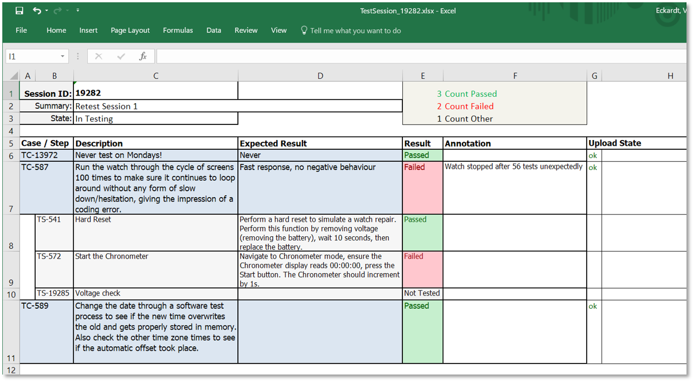

# Integrity Excel Test Session
This local application offers the download and upload from Integrity Test Sessions into an Excel file. The Tester can take the Excel and enter the results offline, connect then again to Integrity und uploads the results then later.



## Use Cases
- Offline Test Result editor
- Full test session export or just the remainin open test results

## Install
Option 1: In IntegrityClient folder
- Put the "dist/IntegrityExcelTestSession.jar" directly into your IntegrityClient folder
- Copy also all the library files from "dist/lib" into your IntegrityClient/lib folder
- Add a custom menu entry with:
```
name: Excel Test Session
program:  ../jre/bin/javaw.exe
parameter: -jar ../IntegrityExcelTestSession.jar
```

Option 2: In a shared folder
- Take all files from "dist" folder and place them somewhere centrally
- Register a custom menu as described before, but with the following change
```
parameter: -jar <your shared folder>/IntegrityExcelTestSession.jar
```

## Template
The Template file (see doc/ExcelTestLayout.xlsx) has to be put into the following directory
- c:\IntegrityExcelTestSession

This path can be parameterized using the IntegrityExcelTestSession.properties file

## How to test
Part 1: Export
- open any Test Session or just stay on one in the query result
- click Custom > Excel Test Session
- The custom form should open
- Start the Export with a click at the [Generate] button
- Then review the outcome

Part 2: Import
- open any Test Session or just stay on one in the query result
- click Custom > Excel Test Session
- The custom form should open
- Start the Import with a click at the [Load] button
- Then review the outcome

## Log File and Debug
A log file is written automatically
- Location: %temp%
- File Name: IntegrityExcelTestSession_2018-01-18.log

This file is valid for a day, then it is written again and gets a new name

A debug option is also the following:
Place the following command into the custom menu:
- cmd /c ../jar/bin/java -jar "path to jar"/IntegrityExcelTestSession.jar & pause

This will open a DOS window in parallel and any logging will become visible immediately.

##  Development environment
- PTC Integrity LM 10.9 (also 11.1 is fine)
- Netbeans 7.4 (or 8)
- Java 1.7 (or 1.8)

## Known Limitations
- This local application does not support images to display. The text downloaded is always plain text only.
